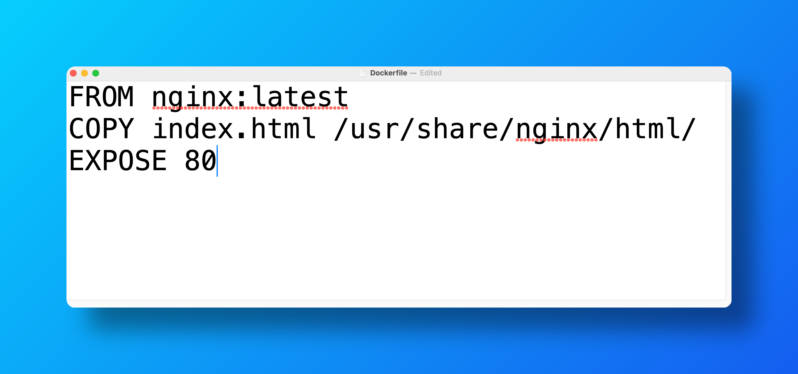
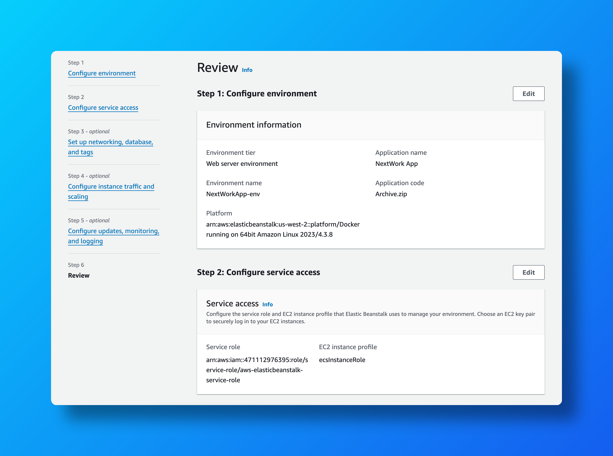
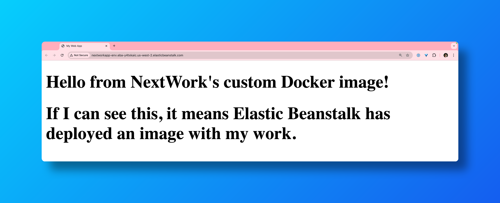

# Deploying a Dockerized App on AWS Elastic Beanstalk 🚀

  
  
  

---

## 📜 Table of Contents

1. [Project Overview](#project-overview)  
2. [Architecture](#architecture)  
3. [Features](#features)  
4. [Key Deliverables](#key-deliverables)  
5. [Challenges and Lessons Learned](#challenges-and-lessons-learned)  
6. [Outcome](#outcome)  
7. [Tools and Technologies Used](#tools-and-technologies-used)  
8. [Steps to Reproduce](#steps-to-reproduce)  
9. [Screenshots](#screenshots)  
10. [Acknowledgments](#acknowledgments)  
11. [Author](#author)  

---

## Project Overview

This project demonstrates deploying a **Dockerized web application** on AWS Elastic Beanstalk. Elastic Beanstalk automates the deployment and management of applications, including provisioning resources, scaling, monitoring, and load balancing. Docker enhances portability, bundling the app and its dependencies into a container.

---

## Architecture

- **Elastic Beanstalk**: Manages the application deployment and scaling.  
- **Docker**: Packages the app with all dependencies for consistent execution.  
- **Load Balancer**: Ensures high availability by distributing incoming traffic.  
- **Amazon S3**: Temporarily stores the application’s deployment package.  

---

## Features

- **Automated Scaling**: Handles increased traffic without manual intervention.  
- **Portability**: Docker containers ensure the app runs consistently across environments.  
- **Load Balancing**: Distributes traffic across multiple instances for high availability.  
- **Monitoring**: Provides health and performance metrics via AWS Management Console.

---

## Key Deliverables

1. **Dockerized Application**:
   - Built a container image using `Dockerfile`.  
   - Verified the image locally before deployment.  

2. **Elastic Beanstalk Environment**:
   - Created an Elastic Beanstalk application.  
   - Configured the environment to use Docker as the platform.  

3. **Deployment**:
   - Packaged the app and uploaded it to Elastic Beanstalk.  
   - Verified deployment and tested live on a public endpoint.  

4. **Load Balancing**:
   - Configured Elastic Beanstalk to automatically manage a load balancer.  

5. **Monitoring**:
   - Set up health checks and monitored application performance.

---

## Challenges and Lessons Learned

### Challenges
- Debugging deployment issues caused by environment misconfigurations.  
- Resolving port conflicts when running Docker containers locally.  

### Lessons Learned
- Elastic Beanstalk simplifies the deployment of Dockerized applications with minimal manual effort.  
- Properly defining the `Dockerfile` and ensuring consistent ports between local and cloud environments are critical for smooth deployment.

---

## Outcome

The project successfully deployed a Dockerized application on Elastic Beanstalk, showcasing its ability to streamline container-based workflows. The app runs reliably in a production-like environment, with features like automated scaling and monitoring fully operational.

---

## Tools and Technologies Used

- **AWS Elastic Beanstalk**: For application deployment and management.  
- **Docker**: For containerizing the application.  
- **AWS CLI**: To manage resources and deployment.  
- **Amazon S3**: For temporary storage during deployment.  
- **Elastic Load Balancer**: For traffic distribution.  

---

## Steps to Reproduce

1. **Prepare the Application**:
   - Write a `Dockerfile` for your app.  
   - Test the Docker container locally using `docker build` and `docker run`.  

2. **Set Up Elastic Beanstalk**:
   - Use the AWS Management Console or CLI to create an Elastic Beanstalk application.  
   - Choose the **Docker** platform for the environment.  

3. **Deploy the Application**:
   - Package the app and upload it to Elastic Beanstalk via the console or CLI.  
   - Wait for the environment to launch and verify its health status.  

4. **Test the Deployment**:
   - Access the app via the Elastic Beanstalk-provided URL.  
   - Verify load balancing by simulating traffic.

---

## Screenshots

### Dockerfile for the Application  
  

### Elastic Beanstalk Configuration  
  

### Deployed Application  
  

---

## Acknowledgments

Thanks to the **NextWork.org** community for their support and resources, and the **AWS Documentation** for comprehensive guidance.

---

## Author

**Hassan Gachoka**  
  
  
